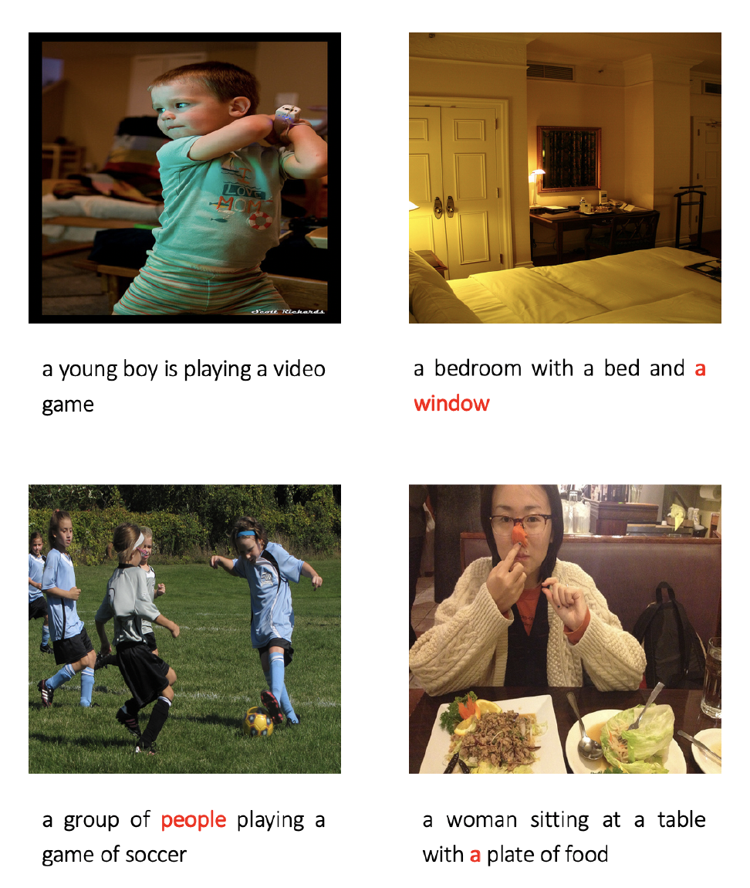
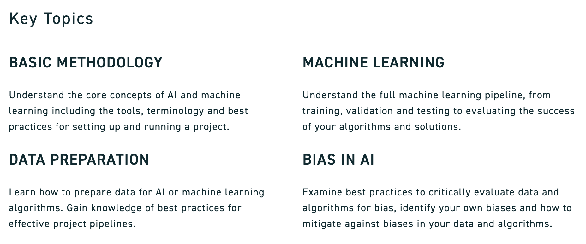

## GitHub Portfolio

---
### [Image Captioning with RNN-based Attention](/pdf/Image_Captioning_with_GRU_based_Attention_AI.pdf)

*Example captions generated by our model*

---
### [SFU DATA FELLOWSHIPS: AI ESSENTIALS](https://www.sfu.ca/big-data/online-data-science-course-data-fellowships utm_source=Email_marketing&utm_medium=HTMLEmail&utm_campaign=Data_Fellowships)

---
### [NLP Business](/sample_page)

---
