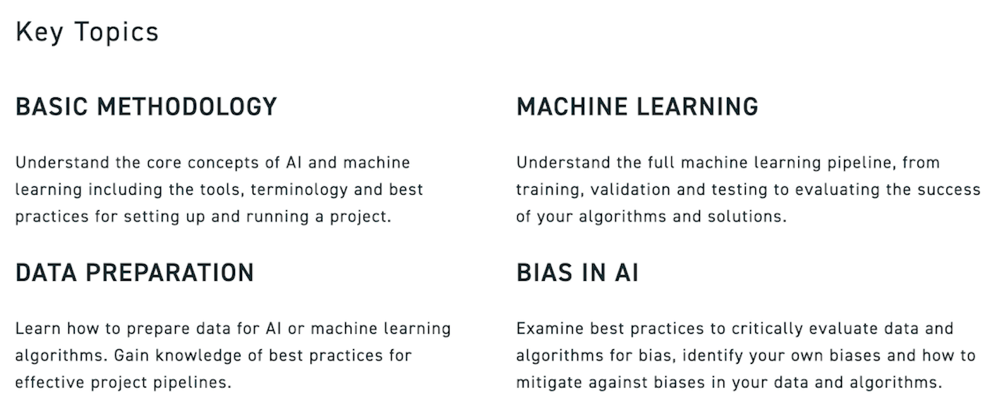

## GitHub Portfolio

---

### Featured Machine Learning Projects

---

#### [Image Captioning with RNN-based Attention (NLP & Vision)](https://github.com/Mehrdad93/Image-captioning-with-RNN-based-attention/blob/master/README.md)

*Example captions generated by the proposed model:*

---

#### [Machine Reading: Named Entity Recognition-Prep (NLP)](https://github.com/Mehrdad93/Machine-Reading/blob/master/README.md)

*Co-occurrence network of "Person_name" and "Place_name" entities:*

---

#### [M.Sc. Thesis: Trajectory Path Prediction of AIMD Simulations with RNN-based Algorithms (Time Series Forecasting & Computational Chemistry)](https://github.com/Mehrdad93/Trajectory-path-prediction/blob/master/Trajectory_prediction_RNN.pdf)

- [View this article on arXiv](https://arxiv.org/abs/1909.10124)

*Predictions of the trajectory of the an atom in the studied compound and total potential energy by (a) GRU and (b) LSTM compared to AIMD baseline:*

*3D visualization of the studied polymer trajectory before reaching the equilibration:*

<!-- *Density plot of coordinates of (a) all atoms (b) randomly chosen atom i, over the AIMD simulation run:* -->
<!--  -->

---

#### [Music Recommendation System with Adjustable Attributes]()

*The proposed recommendation algorithm with user-tuning option:*

---

### Other Projects

---

#### [SFU Data Fellowships: AI Essentials](https://www.sfu.ca/big-data/online-data-science-course-data-fellowships?utm_source=Email_marketing&utm_medium=HTMLEmail&utm_campaign=Data_Fellowships)

---

